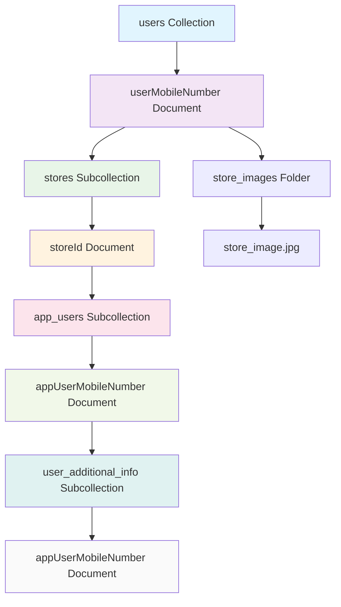
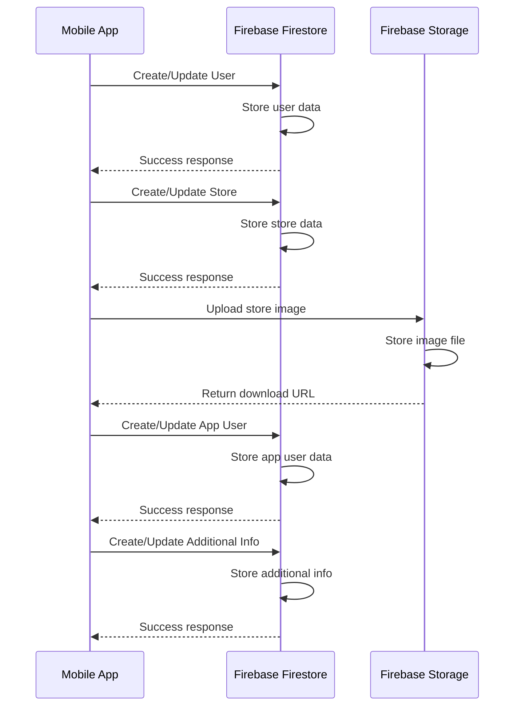

# Firebase Data Structure Documentation

## Overview
This document describes the Firebase Firestore data structure used in the JewelVault Mobile application. The app uses a hierarchical structure to organize user data, store information, and user management data.

## Data Structure Diagram



## Collection Structure

### 1. Users Collection (`users`)
The root collection that contains all user data organized by mobile number.

```
users/
├── {userMobileNumber}/           # Admin/Store Owner Mobile Number
│   ├── stores/                   # Subcollection for store details
│   │   ├── {storeId}/           # Individual store document
│   │   │   ├── app_users/       # Subcollection for app users
│   │   │   │   ├── {appUserMobileNumber}/  # Individual user document
│   │   │   │   │   ├── user_additional_info/  # Subcollection for additional user info
│   │   │   │   │   │   └── {appUserMobileNumber}/  # Additional info document
│   │   │   │   │   └── [user data fields]
│   │   │   │   └── [more users...]
│   │   │   └── [store data fields]
│   │   └── [more stores...]
│   └── [admin user data]
└── [more admin users...]
```

## Detailed Collection Documentation

### 1. Users Collection

**Path**: `users/{userMobileNumber}`

**Description**: Root collection containing admin/store owner information.

**Document Fields**:
- `userId`: string (mobile number as ID)
- `name`: string (user's full name)
- `email`: string (optional email address)
- `mobileNo`: string (mobile number)
- `pin`: string (hashed PIN for security)
- `role`: string (user role - admin, manager, etc.)
- `token`: string (optional FCM token for notifications)

### 2. Stores Subcollection

**Path**: `users/{userMobileNumber}/stores/{storeId}`

**Description**: Contains store information for each admin user.

**Document Fields**:
- `storeId`: string (unique store identifier)
- `userId`: string (admin user's mobile number)
- `proprietor`: string (store owner name)
- `name`: string (store name)
- `email`: string (store email)
- `phone`: string (store phone number)
- `address`: string (store address)
- `registrationNo`: string (business registration number)
- `gstinNo`: string (GST identification number)
- `panNo`: string (PAN number)
- `image`: string (store image URL)
- `invoiceNo`: number (current invoice number)
- `upiId`: string (UPI payment ID)
- `lastUpdated`: timestamp (last update time)

### 3. App Users Subcollection

**Path**: `users/{userMobileNumber}/stores/{storeId}/app_users/{appUserMobileNumber}`

**Description**: Contains information about users who work in each store.

**Document Fields**:
- `userId`: string (user's mobile number as ID)
- `name`: string (user's full name)
- `email`: string (optional email address)
- `mobileNo`: string (mobile number)
- `pin`: string (hashed PIN for security)
- `role`: string (user role - Manager, Worker, Salesperson)

### 4. User Additional Info Subcollection

**Path**: `users/{userMobileNumber}/stores/{storeId}/app_users/{appUserMobileNumber}/user_additional_info/{appUserMobileNumber}`

**Description**: Contains additional personal information about store users.

**Document Fields**:
- `userId`: string (user's mobile number as ID)
- `aadhaarNumber`: string (optional Aadhaar number)
- `address`: string (optional residential address)
- `emergencyContactPerson`: string (optional emergency contact name)
- `emergencyContactNumber`: string (optional emergency contact number)
- `governmentIdNumber`: string (optional government ID number)
- `governmentIdType`: string (optional ID type - PAN, Driving License, etc.)
- `dateOfBirth`: string (optional date of birth)
- `bloodGroup`: string (optional blood group)
- `isActive`: boolean (user active status)
- `createdAt`: timestamp (creation time)
- `updatedAt`: timestamp (last update time)

## Storage Structure

### Store Images
**Path**: `store_images/{mobileNumber}_{uuid}.jpg`

**Description**: Firebase Storage folder containing store profile images.

## Security Rules Structure

```javascript
rules_version = '2';
service cloud.firestore {
  match /databases/{database}/documents {
    // Users can only access their own data
    match /users/{userMobileNumber} {
      allow read, write: if request.auth != null && 
        request.auth.token.phone_number == userMobileNumber;
      
      // Store data access
      match /stores/{storeId} {
        allow read, write: if request.auth != null && 
          request.auth.token.phone_number == userMobileNumber;
        
        // App users access
        match /app_users/{appUserMobileNumber} {
          allow read, write: if request.auth != null && 
            request.auth.token.phone_number == userMobileNumber;
          
          // Additional info access
          match /user_additional_info/{infoId} {
            allow read, write: if request.auth != null && 
              request.auth.token.phone_number == userMobileNumber;
          }
        }
      }
    }
  }
}
```

## Data Flow Diagram



## CRUD Operations Overview

### Create Operations
- Create new admin users in the users collection
- Create new stores in the stores subcollection
- Create new app users in the app_users subcollection
- Create additional user info in the user_additional_info subcollection

### Read Operations
- Retrieve all users for a specific store
- Get individual user details
- Fetch user additional information
- Read store information

### Update Operations
- Update user information
- Modify store details
- Update additional user information
- Change user roles and permissions

### Delete Operations
- Remove users from the system
- Delete store information
- Remove additional user data
- Clean up related documents

## Best Practices

### 1. Data Validation
- Always validate data before writing to Firestore
- Use proper data types and formats
- Implement client-side validation

### 2. Security
- Hash sensitive data like PINs before storage
- Implement proper authentication
- Use security rules to control access

### 3. Performance
- Use batch operations for multiple writes
- Implement proper indexing
- Use pagination for large datasets

### 4. Error Handling
- Implement proper error handling for all operations
- Use try-catch blocks for async operations
- Provide meaningful error messages

## Migration and Backup

### 1. Data Migration
- Implement migration scripts for data structure changes
- Test migrations in development environment
- Backup data before migration

### 2. Backup Strategy
- Regular automated backups
- Export data to JSON format
- Store backups in secure location

## Monitoring and Analytics

### 1. Firestore Usage
- Monitor read/write operations
- Track storage usage
- Monitor performance metrics

### 2. Error Tracking
- Log all errors and exceptions
- Monitor failed operations
- Track user feedback

## Conclusion

This Firebase structure provides a scalable and secure way to manage user data, store information, and user management in the JewelVault Mobile application. The hierarchical structure ensures proper data organization and access control while maintaining good performance and scalability.

For any questions or clarifications about this structure, please refer to the Firebase documentation or contact the development team. 